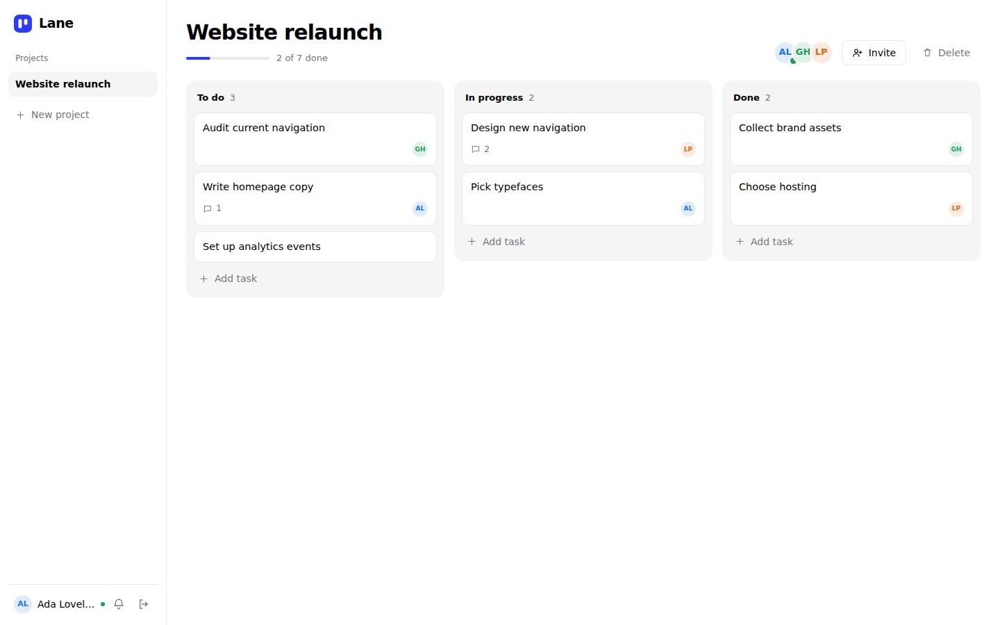

# Lane

A minimal, collaborative project management tool in the spirit of Trello and Asana. Create group projects, assign tasks, and talk inside each task, with everything updating live for everyone on the board.

**Zero npm dependencies.** Node 22+ only: built-in SQLite, a hand-written WebSocket server, scrypt password hashing and HMAC-signed tokens.



## Run it

```bash
node --version        # 22.13 or newer
npm run seed          # optional demo data (ada@lane.dev / password123)
npm start             # http://localhost:3000
```

Open a second browser (or a private window), sign in as `grace@lane.dev`, and watch changes appear in both.

## What it does

| Requirement | Where |
|---|---|
| Auth system | Register / sign in, scrypt-hashed passwords, 7-day signed tokens |
| Group projects | Create projects, invite people by email, everyone on a project shares one board |
| Project boards + task cards | Three lanes (To do, In progress, Done), drag to reorder or change lane |
| Assign tasks | Assignee picker in the task drawer; the assignee is notified |
| Comment and communicate | Threaded comments inside each task, live for everyone viewing it |
| Bonus: notifications | Assignments, comments and project invites, with a bell, unread state and toasts |
| Bonus: real-time updates | WebSockets: cards appear, move and update live; presence dots show who is online |

## Design

Monochrome with one accent. Motion is used only where it explains a change: cards glide to their new position (FLIP), a dashed slot shows where a dragged card will land, the sidebar highlight slides between projects, the progress bar fills, and cards changed by someone else flash briefly. The lanes settle in once on load. Everything respects `prefers-reduced-motion`, and dark mode follows the system setting.

## Architecture

```
server/
  index.js      HTTP server, static files, router, security headers, auth rate limit
  routes.js     REST API and business rules (membership checks, notifications)
  realtime.js   WebSocket server (RFC 6455 framing), presence, per-project broadcast
  auth.js       scrypt password hashing, HMAC-signed tokens
  db.js         node:sqlite schema and transaction helper
  seed.js       demo data
public/
  index.html, styles.css, app.js   vanilla JS client, no build step
```

**Data flow.** Every write goes through the REST API. After a successful write the server broadcasts an event to the project's members over WebSocket. The client applies its own changes optimistically, and events are idempotent, so the echo of your own action is harmless.

### REST API

All routes except `/api/auth/*` need `Authorization: Bearer <token>`. Non-members get `404`, so project ids are not discoverable.

| Method | Path | Purpose |
|---|---|---|
| POST | `/api/auth/register`, `/api/auth/login` | Create account, sign in |
| GET | `/api/me` | Current user |
| GET, POST | `/api/projects` | List, create |
| GET, DELETE | `/api/projects/:id` | Board data (members and tasks), delete (owner only) |
| POST | `/api/projects/:id/members` | Invite by email |
| POST | `/api/projects/:id/tasks` | Create task |
| PATCH | `/api/tasks/:id` | Title, description, assignee |
| POST | `/api/tasks/:id/move` | `{ status, index }` reorders the lane |
| DELETE | `/api/tasks/:id` | Delete task |
| GET, POST | `/api/tasks/:id/comments` | Read and add comments |
| GET | `/api/notifications` | Latest 30 |
| POST | `/api/notifications/read` | Mark all as read |

### WebSocket events (server to client)

Connect to `/ws?token=<token>`. Events: `task:upsert`, `task:delete`, `tasks:sync`, `comment:new`, `member:added`, `project:added`, `project:removed`, `notification`, `presence`. The client reconnects with backoff and re-syncs the open project after a dropped connection.

## Notes and next steps

- The WebSocket token travels in the query string, which is fine locally. Behind a proxy, switch to a short-lived ticket issued by the API so the long-lived token stays out of logs.
- `node:sqlite` is marked experimental in Node 22 and prints a warning at startup. The schema is plain SQL, so moving to Postgres is a small change.
- Broadcasting is in-process. To run several server instances, publish events through Redis pub/sub.
- Ideas: @mentions, due dates, labels, attachments, activity log, keyboard-only card moves.
